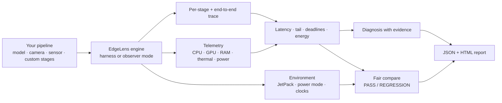

# EdgeLens

**Measure. Diagnose. Validate. Edge AI performance engineering for real pipelines.**

[](https://github.com/Infinity-ops/edgelens/actions/workflows/tests.yml)
[](https://pypi.org/project/edgelens/)
[](https://pypi.org/project/edgelens/)
[](LICENSE)


> Same Jetson Nano, same model, same code: **p99 latency 148 ms → 9.4 ms**
> after pinning clocks. FPS never showed it. EdgeLens did.
> ([measured](#real-results-on-a-jetson-nano))

```bash
pip install edgelens
edgelens doctor                                   # is this board set up right?
edgelens benchmark --model model.onnx --deadline-ms 33
edgelens diagnose                                 # why it is slow, with evidence
```

Most edge monitoring tools tell you _what_ the board is doing (CPU 47%, GPU
92%, 61 °C). EdgeLens tells you **why your pipeline is slow, whether it meets
its deadline, and what each result costs in energy**. It breaks latency down
stage by stage for any pipeline (camera, sensor, signal or custom), measures
the tail and deadline misses, reads board power, and gives an evidence-based
diagnosis on top.

```
$ edgelens benchmark --pipeline examples/timeseries_vibration.py --iterations 1200
  Stage               Role         Mean      p99    Share
  acquire             input        0.004 ms  0.009  1.3%
  filter              preprocess   0.008 ms  0.019  2.5%
  fft                 preprocess   0.022 ms  0.044  7.0%
  feature_extraction  preprocess   0.274 ms  0.458  87.3%
  classify            inference    0.006 ms  0.018  1.9%
  decision            decision     0.000 ms  0.001  0.0%
End-to-end: mean 0.318 ms   Throughput: 3144.65 it/s   (1200 iterations)
min 0.260 · p50 0.283 · p95 0.486 · p99 0.542 · p99.9 0.866 · max 1.354 · jitter 0.082 ms
╭─ Deadline ─ MET  deadline 51.2 ms · misses 0/1200 (0.000%) · worst 1.354 ms ─╮
Real-time factor: mean 0.0062 · p99 0.0106 · max 0.0264 (hop period 51.2 ms, headroom 99.38%)
environment_id 6bc5f4e78f66 · experiment_id 783fa6dc9268 · run_id 20261002T142630-ed4566

$ edgelens diagnose ts.json
  DEADLINE_MET  (strong evidence)
  All 1200 iterations finished within the 51.2 ms deadline; worst 1.354 ms (97% headroom).
```

_(Real output, run on a laptop CPU. On a Jetson the same run also reports
GPU load, board power and energy per window.)_

## How it works



## Status of this release (v0.1.0)

**Validated on a real Jetson Nano** (JetPack 4.6 / L4T R32.7.6, Python 3.8
venv, ONNX Runtime CPU, CUDA and TensorRT providers):

| Area           | Verified on the Nano                                                                                                                                     |
| -------------- | -------------------------------------------------------------------------------------------------------------------------------------------------------- |
| Engine         | `--model` (single and multi-input), `--pipeline` (vision and timeseries), observer mode, paced mode                                                      |
| Statistics     | per-stage and end-to-end latency, p50–p99.9, max, jitter, percentile sample-count rule                                                                   |
| Requirements   | deadline met / missed / thin-margin detection, miss bursts, real-time factor                                                                             |
| Environment    | power mode (nvpmodel) and clock pinning (jetson_clocks) detected; `compare --strict-env` exits 2 across MAXN vs 5W                                       |
| Telemetry      | CPU, RAM, thermal zones, GPU load (sysfs)                                                                                                                |
| Power & energy | INA3221 `POM_5V_IN` read from sysfs: 4.2 W mean, 51.3 mJ per inference (TensorRT, small CNN). Needs root or a one-time `chmod` on JetPack 4.6, see below |
| Outputs        | JSON schema v1 with trace, telemetry series and identities; HTML report; compare exit codes                                                              |

**Implemented, not yet verified on real hardware:**

- **Jetson Orin** support in general (hwmon power layout, JetPack 5/6 GPU
  load paths). Unit-tested against the documented layouts only.
  `edgelens doctor` shows a _Telemetry sources_ table; if a source is
  missing on your board, please open an issue with that table.

**Known limits (by design in v0.1):**

- Stage timing is host wall-clock (`time.perf_counter_ns`), stages run
  sequentially in one thread. GPU-side CUDA-event timing and concurrent
  stages come later.
- The telemetry sampler is a Python thread in the measured process. Its
  CPU cost per sample is reported in every result (`sampler_cpu_ms_mean`)
  so the observer effect is visible, not hidden.
- Power figures are on-module sensor readings with their method
  (`input_rail` / `sum_of_rails`), not a calibrated power meter.
- **Jetson Nano / JetPack 4.x: the power sensor files are root-only.**
  `edgelens doctor` detects this and prints the fix. Either make them
  readable until the next reboot:
  `sudo chmod o+r /sys/bus/i2c/drivers/ina3221x/*/iio:device*/rail_name_* /sys/bus/i2c/drivers/ina3221x/*/iio:device*/in_power*_input`
  or run one benchmark as root: `sudo $(which edgelens) benchmark ...`
  (its output files are then owned by root).
- No built-in camera, video, audio or CAN readers: your own capture code
  becomes the first stage (or use observer mode in your existing loop).
  Recorded signals can be replayed with `WindowSource`.

## Real results on a Jetson Nano

Measured with this release (`tests/fixtures/small_cnn.onnx`, 300 iterations
unless noted):

| Run                                                          | Mean    | p99      | What EdgeLens reported                                                      |
| ------------------------------------------------------------ | ------- | -------- | --------------------------------------------------------------------------- |
| CPU provider, MAXN                                           | 27.8 ms | 30.3 ms  | `INFERENCE_ON_CPU`: 92% of the time is CPU inference                        |
| CPU provider, 5W mode                                        | 86.8 ms | 184.3 ms | `compare --strict-env`: environment mismatch (power mode), exit 2           |
| TensorRT, clocks not pinned (100 it.)                        | 17.8 ms | 148.1 ms | tail is 11x the median; clocks not pinned                                   |
| TensorRT, after `jetson_clocks` (100 it.)                    | 6.8 ms  | 9.4 ms   | 2.6x faster mean, 16x lower p99                                             |
| TensorRT, with board power (clocks not pinned)               | 14.2 ms | 113.4 ms | 4.2 W mean · 51.3 mJ per inference · 19.5 inferences per joule              |
| Timeseries pipeline (10 kHz, 1024/512 window), 2,000 windows | 5.4 ms  | 8.4 ms   | real-time factor 0.11; 0 of 2,000 deadline misses at 51.2 ms; p99.9 10.5 ms |
| Same, released every 2 ms (`--pace`)                         | —       | —        | cannot keep up: queue grows to ~1 s; measured, not simulated                |

The clock-pinning row is the kind of thing EdgeLens exists for: same board,
same model, same code, and a 16x difference in tail latency that FPS alone
would never show.

## Install

```bash
pip install edgelens               # core: any Linux host, Python 3.8+
pip install "edgelens[onnx]"       # + onnxruntime (CPU) for --model
```

**On Jetson, don't install the `[onnx]` extra.** It pulls the CPU-only
`onnxruntime` from PyPI, which replaces NVIDIA's GPU build. Install the
JetPack-matched `onnxruntime-gpu` wheel (see the
[Jetson Zoo](https://elinux.org/Jetson_Zoo#ONNX_Runtime)), then plain
`pip install edgelens`. `edgelens doctor` shows which execution providers
you actually have (you want `Tensorrt, CUDA, CPU`).

From source (contributors):

```bash
git clone https://github.com/Infinity-ops/edgelens
cd edgelens
pip install -e ".[dev,onnx]"       # on Jetson: pip install -e ".[dev]"
python -m pytest -q
```

| Extra      | Adds                       | When you need it                          |
| ---------- | -------------------------- | ----------------------------------------- |
| `dev`      | `pytest`                   | Running `tests/`                          |
| `onnx`     | `onnxruntime` (CPU)        | `--model` on a non-Jetson host            |
| `fixtures` | `onnx` (the model library) | Only to regenerate the test `.onnx` files |

`onnx` is kept out of `dev` on purpose: recent releases pull in
`protobuf>=6`, which broke sibling packages pinned to protobuf 5.x in real
testing.

## Three ways in

### 1. Just a model: `--model`

```bash
edgelens benchmark --model model.onnx --deadline-ms 33
edgelens benchmark --model sensor_model.onnx --input-shape vib:1x8x2048   # dynamic/multi-input
```

Every model input is fed with its declared dtype. Dynamic dimensions of
non-image inputs are never guessed: EdgeLens asks for `--input-shape`
rather than benchmarking a workload that doesn't exist.

### 2. Your own pipeline, EdgeLens drives the loop (harness mode)

```python
import edgelens as el

pipe = el.Pipeline("bearing-monitor", pack="timeseries",
                   sample_rate_hz=10_000, window=1024, hop=512)
pipe.set_source(el.WindowSource("vibration.npy", window=1024, hop=512))

@pipe.stage
def filter(window): ...            # one argument: receives the previous stage's output

@pipe.stage
def fft(x): ...

@pipe.stage(role="inference", device="gpu")
def classify(features): ...

result = pipe.run(iterations=2000)      # deadline defaults to the 51.2 ms hop period
print(result["latency"]["p99"], result["deadline"]["miss_ratio"],
      result["pack_metrics"]["real_time_factor"])
```

The same pipeline from the CLI: put it in a script with a
`build_pipeline()` function and run
`edgelens benchmark --pipeline my_pipeline.py`. See
`examples/timeseries_vibration.py`. Scripts with the classic
`build_stage_fns()` returning a dict still work, and since v0.1.0 the dict
may use **any stage names**.

`pace=True` (CLI `--pace` with `--period-ms`) releases iterations on a fixed
schedule and measures true response time, including queueing behind a slow
iteration.

### 3. Keep your loop, add three lines (observer mode)

```python
with el.trace("webcam-detector", pack="vision", target_fps=30, save="run.json") as t:
    while running:
        with t.iteration():
            with t.stage("capture"):    frame = cam.read()
            with t.stage("inference"):  dets = model(frame)
            with t.stage("postprocess"): out = nms(dets)
```

Then `edgelens diagnose run.json` and `edgelens report run.json` work exactly
as for a benchmark. See `examples/observer_vision_loop.py`.

## Scenario packs

One generic engine; packs add a stage template, scenario metrics and
diagnosis rules in that scenario's language. Stages carry a **role**
(`input`, `preprocess`, `transfer`, `inference`, `postprocess`, `decision`,
`other`), inferred from the name or set explicitly, so the generic
diagnosis rules work for every pipeline.

| Pack         | For                                | Adds                                                                                                                                                                                          |
| ------------ | ---------------------------------- | --------------------------------------------------------------------------------------------------------------------------------------------------------------------------------------------- |
| `vision`     | camera / video / image             | classic 6-stage template; `target_fps` → frame budget as deadline; `BELOW_TARGET_FPS`                                                                                                         |
| `timeseries` | sensor, vibration, audio, IMU, CAN | `sample_rate_hz`/`window`/`hop` → hop period as deadline; real-time factor, headroom, max sustainable rate; `CANNOT_KEEP_UP`, `TAIL_OVERRUNS_HOP`, `HIGH_OVERLAP_COST`; `WindowSource` replay |
| `custom`     | anything else                      | generic metrics and rules                                                                                                                                                                     |

Third-party packs: subclass `edgelens.packs.Pack` and call
`el.register_pack(MyPack())`.

## Commands

| Command                                   | Purpose                                                                                                                                                               |
| ----------------------------------------- | --------------------------------------------------------------------------------------------------------------------------------------------------------------------- |
| `edgelens doctor`                         | Hardware + software fingerprint (board, JetPack/L4T, CUDA, TensorRT, ORT providers, packages) and which telemetry sources work (GPU load, power, thermal, tegrastats) |
| `edgelens monitor`                        | Live dashboard: CPU / GPU / RAM / temperatures / board power                                                                                                          |
| `edgelens benchmark`                      | `--model`, `--pipeline` or `--demo`; per-stage + end-to-end latency, tail, jitter, deadline, power/energy, trace                                                      |
| `edgelens diagnose`                       | Evidence-based verdict (deadline, bottleneck, thermal, memory, pack-specific) with categorical evidence strength                                                      |
| `edgelens report`                         | Self-contained HTML report, attachable to an issue                                                                                                                    |
| `edgelens compare before.json after.json` | Before/after diff of any pipeline; PASS/REGRESSION; warns when the environment differs (`--strict-env` → exit code 2)                                                 |

Useful `benchmark` flags: `--deadline-ms`, `--period-ms`, `--pace`,
`--idle-baseline SECONDS` (measures idle power first, then reports the
workload's dynamic energy), `--input-shape`, `--provider`.

Exit codes: `compare` returns 0 (pass), 1 (regression), 2 (environments
differ, with `--strict-env`), so it drops straight into CI.

## What a result contains (`schema_version: 1`)

Every run (benchmark, observer, demo) writes the same JSON document:

- `pipeline` — name, pack, stages with roles, config
- `latency` — min / mean / std / p50 / p90 / p95 / p99 / p99.9 / max / jitter / tail spread (end-to-end per iteration; response time incl. queueing in paced mode)
- `service_latency` — the pipeline's own work per iteration (what capacity and real-time factor are computed from)
- `stage_stats_ms` — the same statistics per stage
- `requirements`, `deadline` — misses, miss ratio, worst overrun, longest miss burst, median slack
- `backlog` — queueing estimate at the input period (labelled simulated; use `--pace` to measure it)
- `pack_metrics` — e.g. the real-time factor for `timeseries`
- `telemetry` + `telemetry_series` — mean/peak and the full timestamped samples (CPU, GPU, RAM, EMC, temperature, power), plus the sampler's own cost
- `energy` — mean power, energy per iteration, iterations per joule, dynamic energy over idle
- `trace` — one event per stage per iteration (`iter`, `stage`, `start_ns`, `dur_ns`, `thread`)
- `environment` + `identity` — `environment_id` (board, JetPack, versions, **power mode, clock pinning**), `experiment_id` (pipeline, config, model hash), `run_id`

Pre-v0.1.0 files (no `schema_version`) still work with `diagnose`, `report`
and `compare`.

## Evidence, not confidence

Every finding reports `evidence_strength` as **weak / moderate / strong**,
plus the raw numbers behind it, and `data_quality` (iterations, telemetry
sample count). It is deliberately not a percentage: the internal score only
ranks findings and is not a calibrated probability. Telemetry-based findings
from too few samples are demoted and say why. When a deadline is met with
large headroom, bottleneck findings are marked as "where to optimise", not
"a problem".

## Why not just jtop / Nsight / trtexec?

| Tool                | Answers                                                                                                |
| ------------------- | ------------------------------------------------------------------------------------------------------ |
| jetson-stats (jtop) | What is my board doing right now?                                                                      |
| Nsight Systems      | What is my whole system doing, at the CUDA level?                                                      |
| trtexec             | How fast is this one engine?                                                                           |
| **EdgeLens**        | **Does my application meet its budget, why not, what does it cost in energy, and did my change help?** |

EdgeLens does not replace them, and it does not import jetson-stats (AGPL);
it reads the same kernel interfaces directly and stays MIT.

## Contributing and citing

Bug reports with `edgelens doctor` output from your board are the most
valuable contribution right now, especially from Jetson Orin, Xavier and
Orin Nano. See [CONTRIBUTING.md](CONTRIBUTING.md). If you use EdgeLens in
research, please cite it ([CITATION.cff](CITATION.cff); GitHub's "Cite this
repository" button).

## License

MIT, see `LICENSE`.

## Roadmap

See `ROADMAP.md`: v0.2 performance contracts and `validate`, Orin-class
platform depth (DLA, EMC, per-rail power, throttling); v0.3 streaming,
LLM and multi-model packs; v0.4 experiments and edge/cloud.
