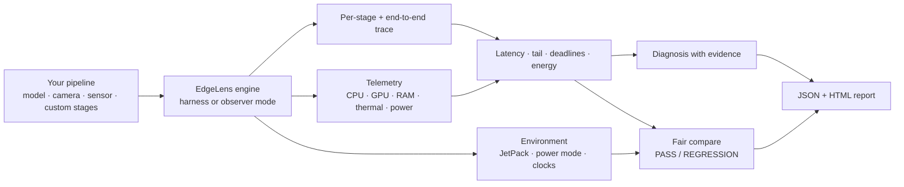

# Architecture

## How it works

One generic engine measures any pipeline (see
[usage.md](usage.md) for the three ways to wire one up); scenario packs
layer scenario-specific metrics and diagnosis rules on top, and every run
— benchmark, observer, or demo — produces the same result document.

## What a result contains (`schema_version: 1`)

Every run (benchmark, observer, demo) writes the same JSON document:

- `pipeline` — name, pack, stages with roles, config
- `latency` — min / mean / std / p50 / p90 / p95 / p99 / p99.9 / max / jitter / tail spread (end-to-end per iteration; response time incl. queueing in paced mode)
- `service_latency` — the pipeline's own work per iteration (what capacity and real-time factor are computed from)
- `stage_stats_ms` — the same statistics per stage
- `requirements`, `deadline` — misses, miss ratio, worst overrun, longest miss burst, median slack
- `backlog` — queueing estimate at the input period (labelled simulated; use `--pace` to measure it)
- `pack_metrics` — e.g. the real-time factor for `timeseries`
- `telemetry` + `telemetry_series` — mean/peak and the full timestamped samples (CPU, GPU, RAM, EMC, temperature, power), plus the sampler's own cost
- `energy` — mean power, energy per iteration, iterations per joule, dynamic energy over idle
- `trace` — one event per stage per iteration (`iter`, `stage`, `start_ns`, `dur_ns`, `thread`)
- `environment` + `identity` — `environment_id` (board, JetPack, versions, **power mode, clock pinning**), `experiment_id` (pipeline, config, model hash), `run_id`

Pre-v0.1.0 files (no `schema_version`) still work with `diagnose`, `report`
and `compare`.

## Evidence, not confidence

Every finding reports `evidence_strength` as **weak / moderate / strong**,
plus the raw numbers behind it, and `data_quality` (iterations, telemetry
sample count). It is deliberately not a percentage: the internal score only
ranks findings and is not a calibrated probability. Telemetry-based findings
from too few samples are demoted and say why. When a deadline is met with
large headroom, bottleneck findings are marked as "where to optimise", not
"a problem".
